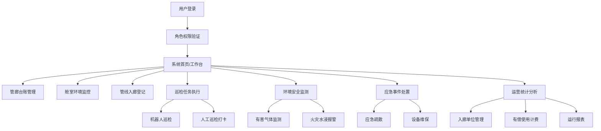

## 1. 产品概述

地下管廊综合运维Web系统是面向管廊运营单位的一体化管理平台，用于管廊舱室、管线、巡检、环境安全及应急处置的全生命周期管理，提升管廊运营效率和安全水平。

- 目标用户：管廊运营管理人员、巡检人员、安全管理人员、决策层
- 核心价值：实现管廊数字化运维，提升安全管控能力，降低运营成本

## 2. 核心功能

### 2.1 用户角色

| 角色 | 登录方式 | 核心权限 |
|------|----------|----------|
| 系统管理员 | 账号密码 | 全部功能管理、用户权限配置 |
| 运营管理人员 | 账号密码 | 台账管理、监控查看、统计分析 |
| 巡检人员 | 账号密码 | 巡检任务执行、打卡记录 |
| 安全管理人员 | 账号密码 | 环境监测、应急处置、告警管理 |

### 2.2 功能模块

1. **管廊台账**：管廊舱段档案管理、基础信息维护
2. **舱室监控**：温湿度、氧气浓度实时监控
3. **管线入廊**：电力、燃气管线入廊登记管理
4. **巡检维护**：机器人巡检、人工巡检打卡
5. **环境安全**：有害气体监测、火灾水浸报警
6. **应急处置**：应急疏散、设备维保管理
7. **运营统计**：入廊单位管理、有偿使用计费、运行报表

### 2.3 页面详情

| 页面名称 | 模块名称 | 功能描述 |
|----------|----------|----------|
| 管廊台账 | 管廊舱段档案 | 管廊基本信息、舱段列表、舱室详情、附属设施档案 |
| 舱室监控 | 温湿氧气监控 | 实时温湿度数据、氧气浓度监测、趋势图表、告警阈值设置 |
| 管线入廊 | 管线入廊登记 | 电力管线登记、燃气管线登记、管线信息查询、入廊审批 |
| 巡检维护 | 机器人巡检 | 巡检任务管理、巡检轨迹、巡检报告、异常记录 |
| 巡检维护 | 人工巡检打卡 | 巡检路线、打卡点管理、巡检记录、人员排班 |
| 环境安全 | 有害气体监测 | CH4/CO/H2S浓度监测、实时数据、超标告警 |
| 环境安全 | 火灾水浸报警 | 烟雾探测、水浸监测、报警记录、处置状态 |
| 应急处置 | 应急疏散 | 疏散预案、疏散路线、应急物资、人员定位 |
| 应急处置 | 设备维保 | 设备台账、维保计划、维保记录、故障报修 |
| 运营统计 | 入廊单位管理 | 单位信息、合同管理、人员管理、入廊许可 |
| 运营统计 | 有偿使用计费 | 计费规则、费用核算、账单管理、缴费记录 |
| 运营统计 | 运行报表 | 运营数据统计、趋势分析、多维度报表、数据导出 |

## 3. 核心流程

用户登录系统后，根据角色权限进入对应功能页面。运营人员管理管廊台账和管线入廊信息，巡检人员执行巡检任务并打卡，安全人员监控环境数据和处理告警，管理人员查看运营统计和报表。

## 4. 用户界面设计

### 4.1 设计风格

- **主色调**：深蓝色系（#0F2C59 深海军蓝），体现专业、可靠、稳重的工业系统气质
- **辅助色**：科技蓝（#0EA5E9）、安全绿（#10B981）、警告橙（#F59E0B）、危险红（#EF4444）
- **中性色**：深灰背景（#0F172A）、中灰边框（#334155）、浅灰文字（#94A3B8）、白色文字（#F8FAFC）
- **设计风格**：深色工业科技风，数据可视化驱动，卡片式布局，硬朗线条
- **字体**：标题使用 Geologica，正文使用 Inter，数字使用等宽字体
- **图标**：使用 lucide-react 图标库，线条风格统一
- **按钮**：直角或微圆角按钮，悬停有发光效果

### 4.2 页面设计概览

| 页面名称 | 模块名称 | UI元素 |
|----------|----------|--------|
| 管廊台账 | 管廊舱段档案 | 左侧树形结构、右侧详情卡片、数据表格、筛选栏、状态标签 |
| 舱室监控 | 温湿氧气监控 | 仪表盘、实时曲线图、数据卡片、告警指示灯、舱室选择器 |
| 管线入廊 | 管线入廊登记 | 标签页切换、表单弹窗、数据列表、状态流转、搜索筛选 |
| 巡检维护 | 机器人巡检 | 时间轴、轨迹图、巡检报告卡片、异常标记点 |
| 巡检维护 | 人工巡检打卡 | 打卡点地图、巡检记录表格、人员状态、排班日历 |
| 环境安全 | 有害气体监测 | 气体浓度仪表盘、实时数据、告警列表、趋势图 |
| 环境安全 | 火灾水浸报警 | 告警卡片、报警列表、处置状态、声光效果提示 |
| 应急处置 | 应急疏散 | 疏散路线图、应急物资清单、人员统计、预案卡片 |
| 应急处置 | 设备维保 | 设备卡片、维保计划日历、维保记录、报修工单 |
| 运营统计 | 入廊单位管理 | 单位卡片网格、合同列表、人员统计、许可状态 |
| 运营统计 | 有偿使用计费 | 费用仪表盘、账单列表、计费规则、缴费统计 |
| 运营统计 | 运行报表 | 多维度图表、数据统计卡片、报表筛选、导出功能 |

### 4.3 响应式设计

- 桌面端优先设计（1440px+）
- 侧边栏可折叠，适配不同屏幕宽度
- 数据表格支持横向滚动
- 图表组件自适应容器宽度
- 平板端保持主要功能可用

### 4.4 数据可视化设计

- 使用 Recharts 图表库实现数据可视化
- 仪表盘展示关键指标（温湿度、气体浓度等）
- 折线图展示历史趋势数据
- 柱状图展示统计对比数据
- 饼图展示占比分析数据
- 告警状态使用颜色编码和动画效果
