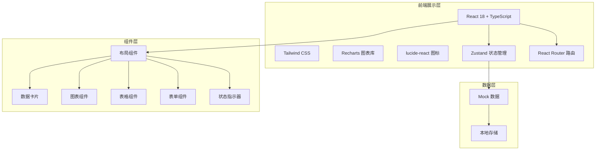

## 1. 架构设计



## 2. 技术选型

- **前端框架**：React 18 + TypeScript
- **构建工具**：Vite 5
- **样式方案**：Tailwind CSS 3
- **路由管理**：React Router DOM 6
- **状态管理**：Zustand 4
- **图表库**：Recharts 2
- **图标库**：lucide-react
- **UI组件**：自定义组件（基于Tailwind）
- **数据**：Mock 数据模拟

## 3. 路由定义

| 路由路径 | 页面名称 | 说明 |
|----------|----------|------|
| / | 工作台/首页 | 系统概览、关键指标、快捷入口 |
| /ledger | 管廊台账 | 管廊舱段档案管理 |
| /monitor | 舱室监控 | 温湿氧气实时监控 |
| /pipeline | 管线入廊 | 电力燃气管线入廊登记 |
| /inspection | 巡检维护 | 机器人巡检、人工巡检打卡 |
| /safety | 环境安全 | 有害气体监测、火灾水浸报警 |
| /emergency | 应急处置 | 应急疏散、设备维保 |
| /statistics | 运营统计 | 入廊单位、计费、报表 |

## 4. 数据模型

### 4.1 核心数据结构

```typescript
// 管廊舱段
interface TunnelSection {
  id: string;
  name: string;
  code: string;
  length: number;
  width: number;
  height: number;
  type: 'comprehensive' | 'power' | 'gas' | 'water';
  status: 'normal' | 'maintenance' | 'fault';
  buildDate: string;
  location: string;
  description: string;
}

// 环境监测数据
interface EnvironmentData {
  id: string;
  sectionId: string;
  timestamp: string;
  temperature: number;
  humidity: number;
  oxygen: number;
  ch4: number;
  co: number;
  h2s: number;
  smoke: boolean;
  waterlogging: boolean;
}

// 管线信息
interface Pipeline {
  id: string;
  type: 'power' | 'gas' | 'water' | 'communication';
  name: string;
  code: string;
  diameter: number;
  length: number;
  owner: string;
  inDate: string;
  status: 'normal' | 'maintenance' | 'decommissioned';
  sectionIds: string[];
}

// 巡检记录
interface InspectionRecord {
  id: string;
  type: 'robot' | 'manual';
  taskName: string;
  inspector?: string;
  sectionIds: string[];
  startTime: string;
  endTime?: string;
  status: 'pending' | 'in_progress' | 'completed' | 'abnormal';
  abnormalities?: string[];
}

// 告警记录
interface AlarmRecord {
  id: string;
  type: 'fire' | 'waterlogging' | 'gas' | 'temperature' | 'equipment';
  level: 'critical' | 'warning' | 'info';
  location: string;
  description: string;
  timestamp: string;
  status: 'unhandled' | 'processing' | 'resolved';
  handler?: string;
}

// 入廊单位
interface TenantUnit {
  id: string;
  name: string;
  type: 'power' | 'gas' | 'water' | 'communication' | 'other';
  contactPerson: string;
  contactPhone: string;
  contractStart: string;
  contractEnd: string;
  fee: number;
  status: 'active' | 'expired' | 'pending';
}

// 设备
interface Equipment {
  id: string;
  name: string;
  code: string;
  type: string;
  location: string;
  installDate: string;
  lastMaintenance: string;
  nextMaintenance: string;
  status: 'normal' | 'maintenance' | 'fault' | 'scrapped';
}
```

## 5. 目录结构

```
src/
├── components/          # 公共组件
│   ├── layout/         # 布局组件
│   │   ├── Sidebar.tsx
│   │   ├── Header.tsx
│   │   └── MainLayout.tsx
│   ├── charts/         # 图表组件
│   ├── cards/          # 数据卡片
│   ├── tables/         # 表格组件
│   └── ui/             # 基础UI组件
├── pages/              # 页面组件
│   ├── Dashboard.tsx
│   ├── Ledger.tsx
│   ├── Monitor.tsx
│   ├── Pipeline.tsx
│   ├── Inspection.tsx
│   ├── Safety.tsx
│   ├── Emergency.tsx
│   └── Statistics.tsx
├── store/              # 状态管理
│   └── useAppStore.ts
├── data/               # Mock数据
│   ├── tunnel.ts
│   ├── environment.ts
│   ├── pipeline.ts
│   ├── inspection.ts
│   └── alarm.ts
├── types/              # 类型定义
│   └── index.ts
├── utils/              # 工具函数
│   └── format.ts
├── App.tsx
├── main.tsx
└── index.css
```
